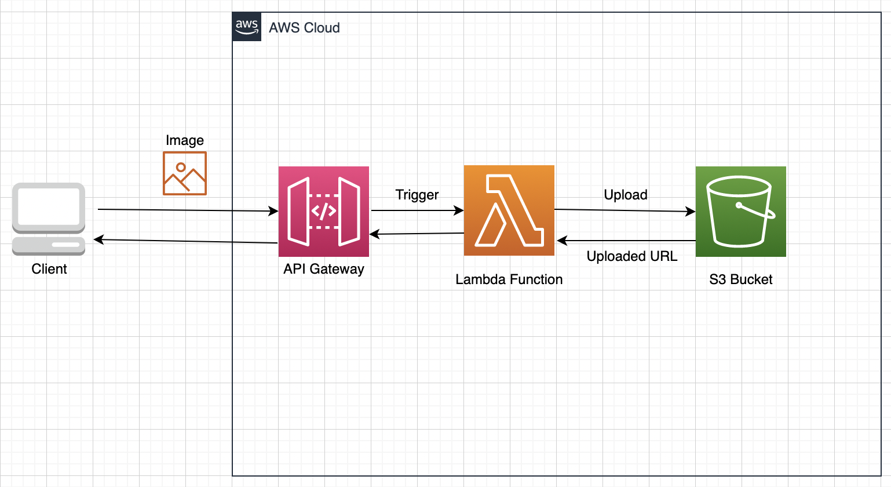

# Compress and upload image to S3 with Lambda

<h2>전반적인 아키텍쳐</h2>

<h2>개발하며 정리한 글</h2>

- <a href="https://github.com/sang-w0o/Study/blob/master/AWS/Backend/Lambda%EB%A1%9C%20%EC%9D%B4%EB%AF%B8%EC%A7%80%20%EC%95%95%EC%B6%95%20%EA%B5%AC%ED%98%84%ED%95%98%EA%B8%B0.md">링크</a>

<h2>사용법</h2>

<h3>Github Repository Secret 설정값</h3>

- `AWS_ACCESS_KEY_ID`: Lambda 배포 권한을 가진 AWS IAM 사용자의 access key
- `AWS_SECRET_ACCESS_KEY`: Lambda 배포 권한을 가진 AWS IAM 사용자의 secret key
- `AWS_S3_BUCKET`: 사진을 저장할 S3 Bucket 이름

<h3>예시 페이지</h3>

- 프로젝트를 clone 받은 directory 내의 `web` 폴더로 이동하여  
   `yarn start`를 통해 React Application을 실행한다.  
   이때, 아래를 주의하자.

  - 환경 변수(`.env`)에 API Gateway Endpoint를 `REACT_APP_IMAGE_UPLOAD_URL`로 설정해줘야 한다.
  - `yarn start`에 실패한다면 로컬 머신의 프로젝트 root 폴더에 있는 `yarn.lock` 파일과 `node_modules`  
    폴더를 삭제하고 실행하면 된다.

