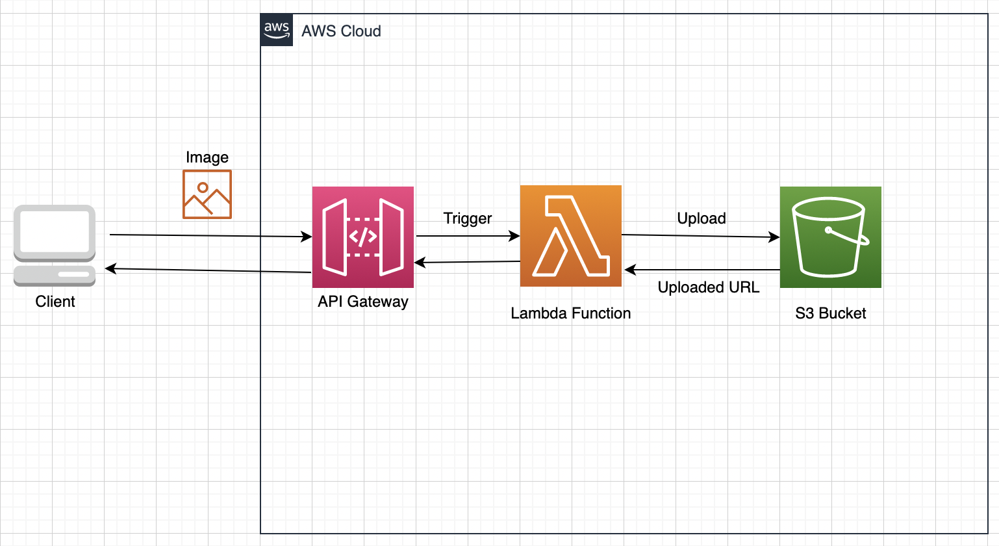

# Compress and upload image to S3 with Lambda

## 전반적인 아키텍쳐

### 개발하며 정리한 글

- [링크](https://github.com/sang-w0o/Study/blob/master/AWS/Backend/Lambda%EB%A1%9C%20%EC%9D%B4%EB%AF%B8%EC%A7%80%20%EC%95%95%EC%B6%95%20%EA%B5%AC%ED%98%84%ED%95%98%EA%B8%B0.md)

### Github Repository Secret 설정값

- `AWS_ACCESS_KEY_ID`: Lambda 배포 권한을 가진 AWS IAM 사용자의 access key
- `AWS_SECRET_ACCESS_KEY`: Lambda 배포 권한을 가진 AWS IAM 사용자의 secret key
- `AWS_S3_BUCKET`: 사진을 저장할 S3 Bucket 이름

---
